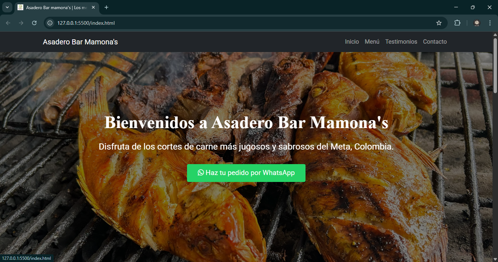
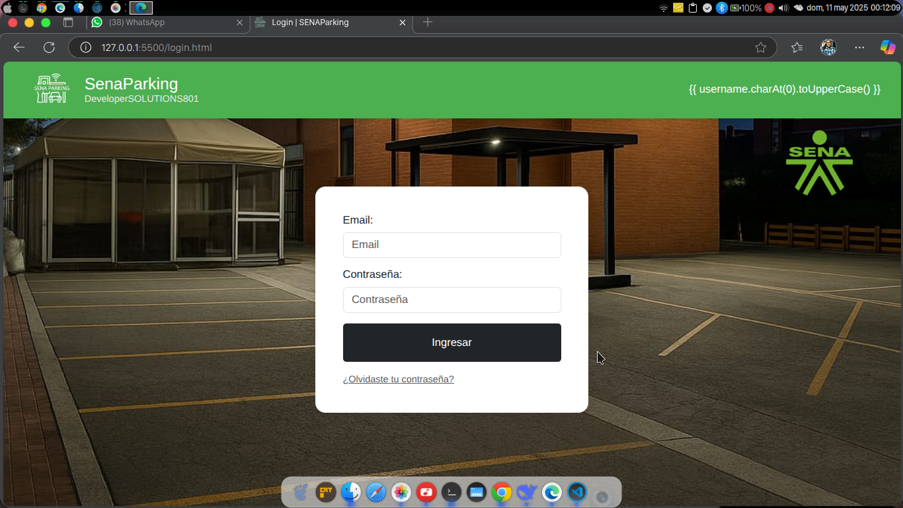

# 👋 ¡Hola! Soy Cristian 👨‍💻

### 💻 Técnico de Sistemas & Desarrollador Fullstack  
🎯 Apasionado por la tecnología, la resolución de problemas reales y la creación de soluciones funcionales y seguras.

---

  

---

## 🚀 Sobre mí

Soy técnico de sistemas y desarrollador fullstack con experiencia en soporte técnico, mantenimiento de equipos, diseño de redes y desarrollo de aplicaciones web.  
He trabajado en sectores como el bancario, educativo y empresarial, siempre aplicando buenas prácticas de ciberseguridad y enfocándome en la eficiencia y la mejora continua.

---

## 🧰 Tecnologías y Herramientas

---

## 📂 Proyectos Destacados

### 🍖 [Asadero Bar Mamonas](https://github.com/tuusuario/asadero-bar-mamonas)  
**Link al sitio web:** ➡️ https://asaderobar-mamonas.web.app/
Sitio web responsive para restaurante, enfocado en visibilidad y pedidos online.  
**Tecnologías:** HTML, CSS, Bootstrap, JavaScript

 <!-- Reemplaza este link por un gif o screenshot -->

---

### 💼 [SI-POS (Sistema Punto de Venta)](https://github.com/tuusuario/SI-POS)  
Aplicación web para gestionar ventas, inventarios y reportes de manera eficiente.  
**Tecnologías:** HTML, CSS, JavaScript, PHP, MySQL

---

### 🚗 [SENAParking](https://github.com/tuusuario/SENAParking)  
Sistema de control de parqueaderos con seguimiento, disponibilidad y reportes.  
**Tecnologías:** HTML, CSS, JavaScript, Bootstrap, Node.js, MySQL

---

## 🏆 Logros Destacados

- ✔️ Reduje los tiempos de soporte técnico en un 30% mediante automatización y buenas prácticas.  
- ✔️ Desarrollé sistemas funcionales adoptados por negocios reales.  
- ✔️ Apliqué principios de ciberseguridad en cada proyecto.  
- ✔️ Reconocido por desempeño y cumplimiento de objetivos técnicos y de calidad.  
- ✔️ Becas por alto rendimiento académico.

---

## 📫 ¿Hablamos?

Estoy abierto a nuevas oportunidades, colaboraciones o simplemente conectar.  
Si te interesa trabajar conmigo o querés saber más sobre mis proyectos:

📧 **Correo:** habacucdeveloper@gmail.com  
🌐 **Portafolio:** [HabacucDev.com](https://github.com/HabacucDev)  
📍 **Ubicación:** Colombia 🇨🇴  
📱 **WhatsApp:** [Envíame un mensaje](https://wa.me/573108727246?text=Hola%20Cristian%2C%20vi%20tu%20perfil%20en%20GitHub%20y%20me%20gustaría%20hablar%20contigo%20sobre%20una%20oportunidad)

---

## 🙌 Gracias por visitar mi perfil

> *"No se trata solo de escribir código, sino de crear soluciones que realmente funcionen."*

---

⭐ ¡No olvides darle una estrella ⭐ a mis proyectos si te gustan!
