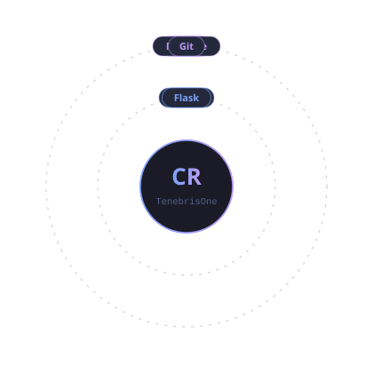
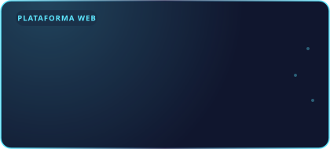
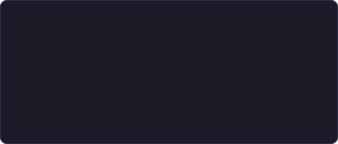
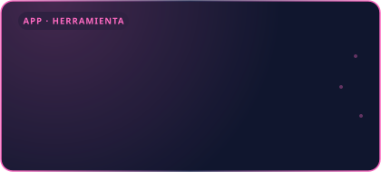
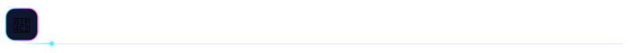
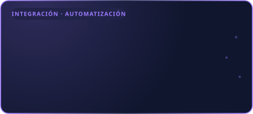
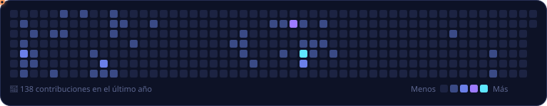

<!-- ═══════════════════ HERO ANIMADO ═══════════════════ -->

  

  

  
  
  
  

Soy técnico de sistemas y desarrollador fullstack con experiencia en los sectores **bancario, educativo y empresarial**. He construido **más de 19 proyectos** entre plataformas de gestión, sistemas de punto de venta, CRMs e integraciones con Odoo ERP.

- 🔧 Desarrollo plataformas web completas con **PHP, Python y MySQL**
- 🔌 Automatizo procesos empresariales integrando **Odoo** vía XML-RPC / JSON-RPC con **Python y Flask**
- 🖥️ Administro **servidores VPS Linux**: Apache, Nginx, dominios, certificados SSL, PM2 y despliegues en producción
- 🛡️ Aplico buenas prácticas de **ciberseguridad** en cada proyecto
- ⚡ Reduje tiempos de soporte técnico en un **30%** mediante automatización

 

<table>
<tr>
<td width="42%" align="center">
  
</td>
<td>
  <b>Backend</b>  
  
  
  
  
    
  <b>Frontend</b>  
  
  
  
  
    
  <b>Integraciones y ERP</b>  
  
  
  
  
</td>
</tr>
</table>

**Servidores y administración VPS**

**Herramientas y despliegue**

  

🚗 <a href="https://github.com/TenebrisOne/SENAParking"><b>Ver código en GitHub →</b></a>

  

💼 <i>Proyecto para cliente real — código bajo acuerdo de confidencialidad</i>

  

🍖 <a href="https://asaderobar-mamonas.web.app/"><b>Ver sitio en vivo →</b></a> · <a href="https://github.com/TenebrisOne/asadero-bar-mamonas">Código</a>

 

### 🏗️ Plataformas y sistemas web

  
  
  
  
  
  
  
  
  
  

### 🔌 Integraciones y automatizaciones

  
  
  
  
  
  
  

### 🧰 Web, apps y herramientas

  
  
  
  

> 🟢 **PÚBLICO** = repositorio abierto (la tarjeta enlaza al código) · 🟡 **PRIVADO** = proyecto para clientes reales, código bajo acuerdo de confidencialidad

  
  

  

  

  

  

- ✔️ Reduje los tiempos de soporte técnico en un 30% mediante automatización y buenas prácticas.
- ✔️ Desarrollé sistemas funcionales adoptados por negocios reales.
- ✔️ Administro la infraestructura completa de mis despliegues: VPS, Apache/Nginx, SSL y dominios.
- ✔️ Apliqué principios de ciberseguridad en cada proyecto.
- ✔️ Reconocido por desempeño y cumplimiento de objetivos técnicos y de calidad.
- ✔️ Becas por alto rendimiento académico.

 

Estoy abierto a nuevas oportunidades, colaboraciones o simplemente conectar.

📧 **Correo:** habacucdeveloper@gmail.com
🌐 **Portafolio:** [cristianruiz-dev.web.app](https://cristianruiz-dev.web.app/)
📱 **WhatsApp:** [Envíame un mensaje](https://wa.me/573205426621?text=Hola%20Cristian%2C%20vi%20tu%20perfil%20en%20GitHub%20y%20me%20gustar%C3%ADa%20hablar%20contigo%20sobre%20una%20oportunidad)
📍 **Ubicación:** Colombia 🇨🇴

 

> *"No se trata solo de escribir código, sino de crear soluciones que realmente funcionen."*

